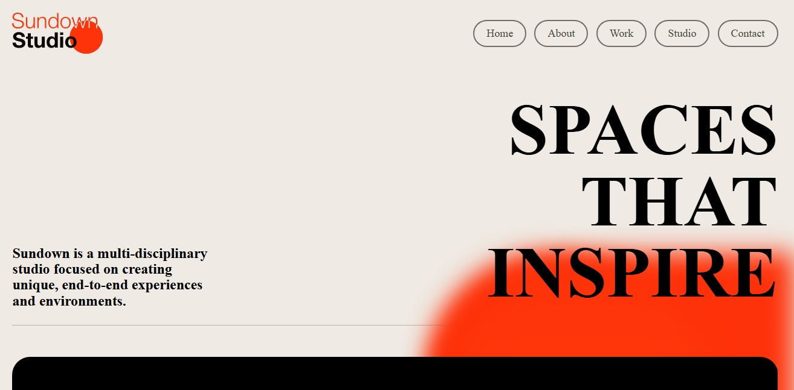
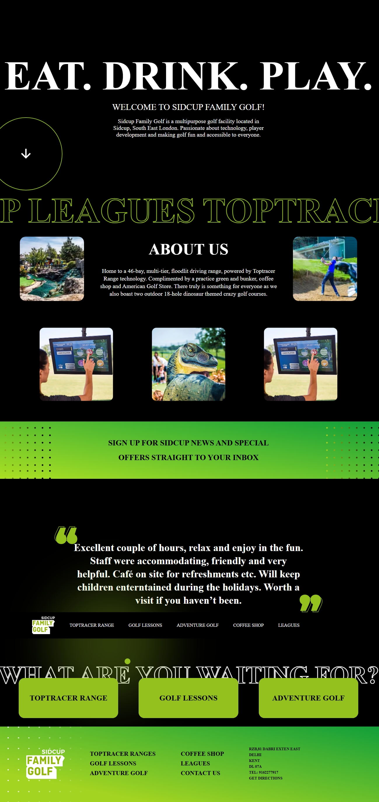
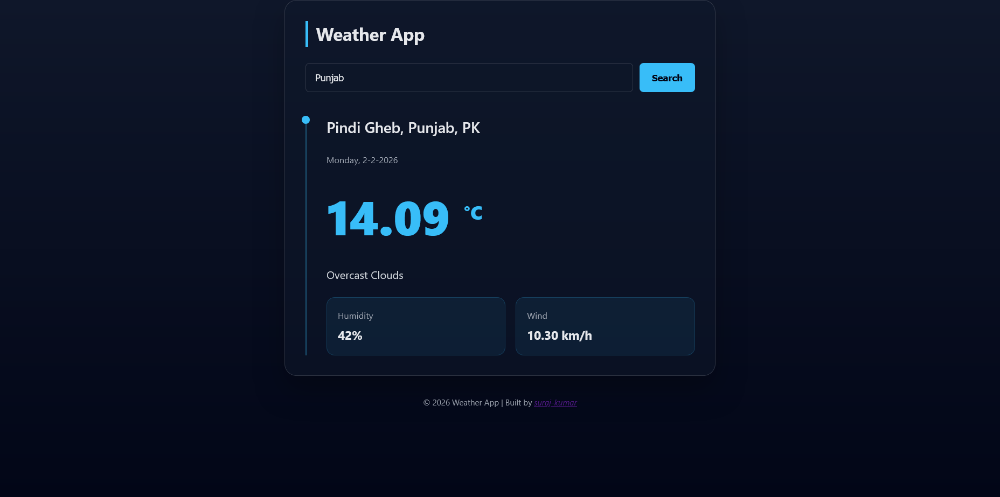

<div align="center">

# 👨‍💻 Suraj Kumar
<b>
<p>
  
</p>
</b>

<p>
I build responsive, user-focused web interfaces with clean and maintainable code.
Skilled in HTML, CSS, JavaScript, React.js, PHP, and MySQL.
I focus on modern UI/UX principles to turn ideas and designs into functional,
real-world web applications.
</p>

</div>

<br/>

<p align="center">
  <a href="https://github.com/surajkumar9113">
    
  </a>

  <a href="https://www.linkedin.com/in/suraj-kumar-331a58349/">
    
  </a>

  <a href="https://surajkumar9113.github.io/suraj-portfolio/">
    
  </a>

  <a href="mailto:surajyadav5557@gmail.com">
    
  </a>
</p>

</div>

<br/>

## 📱 About Me

Front-End Developer focused on building  
responsive, user-friendly and modern interfaces.

```javascript
const developer = {
  name: "Suraj Kumar",
  role: "Front-End Developer",
  skills: ["HTML", "CSS", "JavaScript", "React", "PHP"]
};
```
<br/>

<div align="center">

## 🛠️ Technical Skills

### Frontend


### Backend / API


### Tools


</div>
<br/>

## 💼 Featured Projects

<table>
<tr>
<td width="50%">


</td>
<td width="50%">

### Netflix Landing Page / Netflix UI Clone

A modern Netflix-inspired streaming landing page with a cinematic hero section, trending content, subscription plans, and responsive layout.

**Tech Stack:** HTML5, CSS3, JavaScript

**Key Features:**
- Hero section
- Trending movies section
- Subscription plans
- Responsive design
- Modern dark UI
- CTA sections

[](https://github.com/surajkumar9113)
[](https://surajkumar9113.github.io/netflix-frontend-clone/)

</td>
</tr>

<tr>
<td width="50%">

<a href="https://surajkumar9113.github.io/suraj-portfolio/" target="_blank">
</a>
</td>
<td width="50%">

5, CSS3, JavaScript
### Personal Portfolio Website

A professional personal portfolio website showcasing my profile, technical skills, projects, experience, education, and contact information.

**Tech Stack:** HTML
**Key Features:**
- Developer introduction
- About section
- Technical skills
- Experience
- Education
- Projects
- Contact section
- Responsive design

[](https://github.com/surajkumar9113)
[](https://surajkumar9113.github.io/suraj-portfolio/)

</td>
</tr>

<tr>
<td width="50%">


</td>
<td width="50%">

### Sundown Studio Website

A visually focused creative studio website inspired by modern agency websites, using bold typography, large layouts, and creative visual sections.

**Tech Stack:** HTML5, CSS3, JavaScript

**Key Features:**
- Modern agency layout
- Large typography
- Creative hero section
- Navigation
- Responsive design
- Visual storytelling

[](https://github.com/surajkumar9113)
[](https://surajkumar9113.github.io/Sundown-Studio/)

</td>
</tr>

<tr>
<td width="50%">


</td>
<td width="50%">

### Sidcup Family Golf Website

A modern golf and entertainment website featuring promotional sections, services, images, testimonials, and navigation.

**Tech Stack:** HTML5, CSS3, JavaScript

**Key Features:**
- Hero section
- About section
- Golf services
- Image sections
- Testimonials
- Newsletter CTA
- Footer navigation
- Responsive layout

[](https://github.com/surajkumar9113)
[](https://surajkumar9113.github.io/sidcup-golf-family/)

</td>
</tr>

<tr>
<td width="50%">


</td>
<td width="50%">

### Goku / Saiyan Warrior Landing Page

A cinematic anime-inspired landing page featuring a powerful visual hero section and modern presentation.

**Tech Stack:** HTML5, CSS3, JavaScript

**Key Features:**
- Full-screen hero section
- Background imagery
- Modern typography
- CTA button
- Visual effects
- Responsive design

[](https://github.com/surajkumar9113)

</td>
</tr>

<tr>
<td width="50%">


</td>
<td width="50%">

### Weather App

A weather application that allows users to search for a location and view weather information including temperature, humidity, wind speed, and weather conditions.

**Tech Stack:** HTML5, CSS3, JavaScript, REST API

**Key Features:**
- City search
- Weather API integration
- Temperature display
- Humidity
- Wind speed
- Weather condition
- Dynamic UI

[](https://github.com/surajkumar9113)
[](https://surajkumar9113.github.io/Weather-Application/)

</td>
</tr>

<tr>
<td width="50%">


</td>
<td width="50%">

### Codex Institute

A modern technology and education brand concept with a clean visual identity focused on coding and technology.

**Tech Stack:** HTML5, CSS3, JavaScript

**Key Features:**
- Modern branding
- Technology-focused UI
- Responsive design
- Clean visual presentation

[](https://github.com/surajkumar9113)
[](https://surajkumar9113.github.io/Codex/)

</td>
</tr>

</table>

<br/>

## 📋 Featured Projects

A selection of frontend projects demonstrating my experience with
**responsive design, JavaScript interactions, API integration, UI development,
and modern web layouts.**

| Project | Technologies | Category | Live Demo |
|---|---|---|---|
| 🎬 **Netflix Landing Page** | HTML5, CSS3, JavaScript | Streaming UI | [View Demo](https://surajkumar9113.github.io/netflix-frontend-clone/) |
| 👨‍💻 **Personal Portfolio** | HTML5, CSS3, JavaScript | Portfolio | [View Demo](https://surajkumar9113.github.io/suraj-portfolio/) |
| 🌅 **Sundown Studio** | HTML5, CSS3, JavaScript | Creative UI | [View Demo](https://surajkumar9113.github.io/Sundown-Studio/) |
| ⛳ **Sidcup Family Golf** | HTML5, CSS3, JavaScript | Business UI | [View Demo](https://surajkumar9113.github.io/sidcup-golf-family/) |
| 🐉 **Saiyan Warrior** | HTML5, CSS3, JavaScript | Interactive UI | — |
| 🌦️ **Weather Application** | HTML5, CSS3, JavaScript, REST API | Web Application | [View Demo](https://surajkumar9113.github.io/Weather-Application/) |
| 💻 **Codex Institute** | HTML5, CSS3, JavaScript | Educational UI | [View Demo](https://surajkumar9113.github.io/Codex/) |

<br/>

## 🚀 Currently Learning

- ⚛️ **React.js** — Component-based frontend development
- 🐘 **PHP** — Backend development & server-side programming
- 📊 **Microsoft Excel** — Data handling & productivity
- 🔗 **API Integration** — Working with REST APIs
- 🧩 **Modern UI Development** — Building responsive interfaces
<br/>

## 📊 GitHub Stats

<p align="center">
  
  
</p>

<div align="center">

## 📫 Let's Connect

<a href="https://github.com/surajkumar9113">
  
</a>
<a href="https://www.linkedin.com/in/suraj-kumar-331a58349/">
  
</a>
<a href="https://surajkumar9113.github.io/suraj-portfolio/">
  
</a>
<a href="mailto:surajyadav5557@gmail.com">
  
</a>

</div>
<h2>🐍 Snake Contribution </h2>

<p align="center">
  
</p>
<div align="center">

**Thanks for visiting my profile! Let's build something amazing together.** 🚀


</div>

